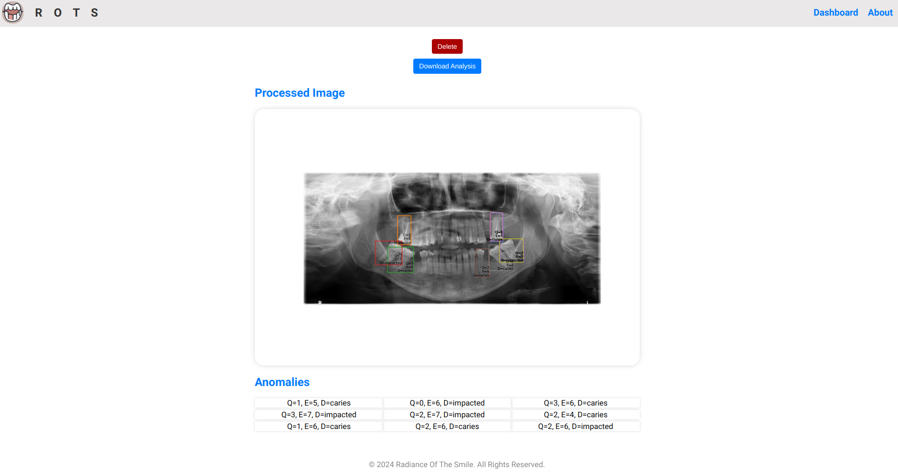
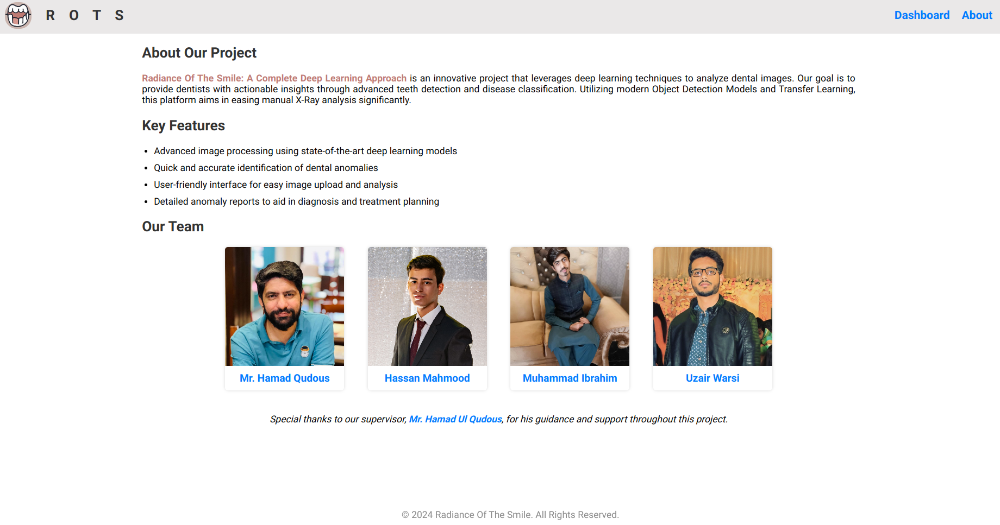

# Radiance Of The Smile: A Complete Deep Learning Approach

This ReactJS application is part of the "Radiance Of The Smile" Organization, which employs a complete deep learning approach for image analysis. It allows users to upload an image for analysis, preprocess it using a deep learning model, and view the processed image along with detected anomalies.

## Screenshots
<p align="center">
  
  
</p>

## Project Structure

```
my-react-app/
├── src/
│   ├── components/
│   └── containers/
├── public/
│   ├── index.html
│   └── ...
├── package.json
├── package-lock.json
├── .gitignore
├── README.md
├── component_tree_structure.png
└── ...
```

## Getting Started

To run this application locally, follow these steps:

1. Clone the repository: `git clone https://github.com/Radiance-Of-The-Smile/frontend.git`
2. Navigate to the project directory: `cd frontend`
3. Install dependencies: `npm install`
4. Start the development server: `npm start`
5. Open your browser and visit `http://localhost:3000`

## Usage

1. Click on the "Choose Image" button to select an image for analysis.
2. Click on the "Get Analysis" button to upload the selected image and receive the processed image and detected anomalies.
3. Optionally, click on the "Download Analysis" button to download the processed image.
4. Click on the "Remove Analysis" button to remove the processed image and anomalies.<br>
<strong>PS: These buttons appear dynamically so don't worry if you don't find all 4 of these together!</strong>

## Dependencies

This application uses the following dependencies:

- React: Frontend JavaScript library for building user interfaces.
- axios: HTTP client for making API requests.
- FormData: API for creating form data objects to send with HTTP requests.
- react-router react-router-dom: Routes for Dashboard and About page.

## Credits

- Developed by [Muhammad Ibrahim](https://www.linkedin.com/in/mibrahim39/), [Hassan Mahmood](https://www.linkedin.com/in/ihassanmahmood/), and [Hafiz Uzair Warsi](https://www.linkedin.com/in/hafiz-uzair/).
- Special thanks to our supervisor [Mr. Hamad Ul Qudous](https://www.linkedin.com/in/hamad-ulqudous-3a2a4869/).
